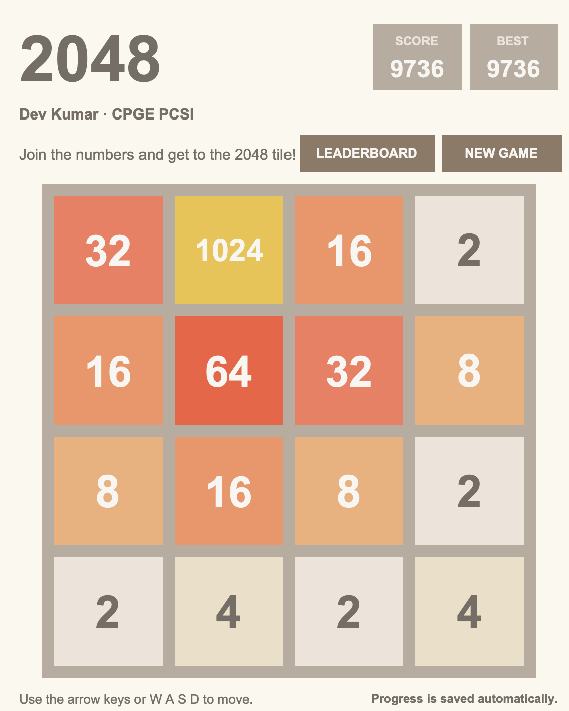
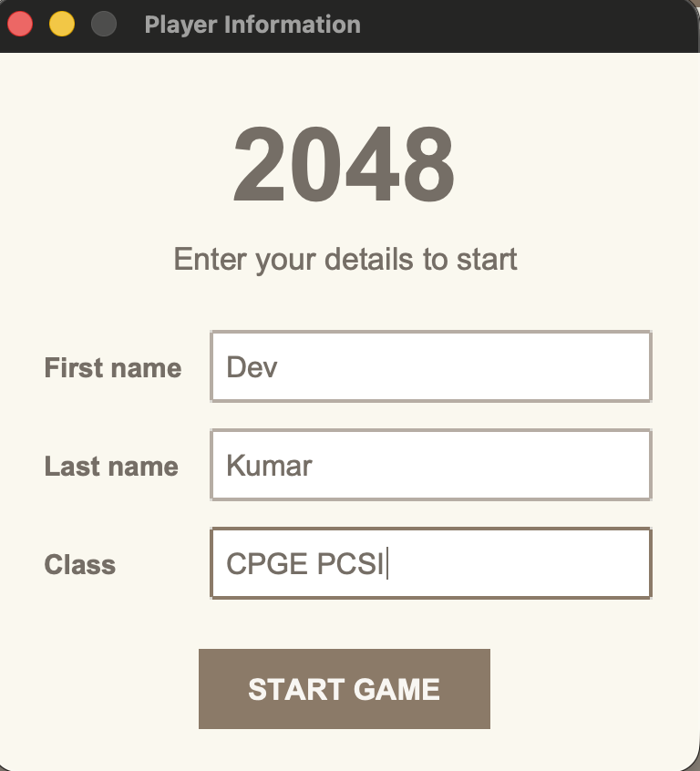
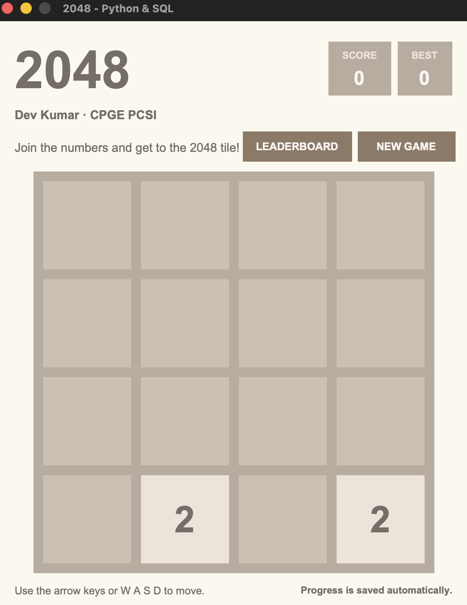
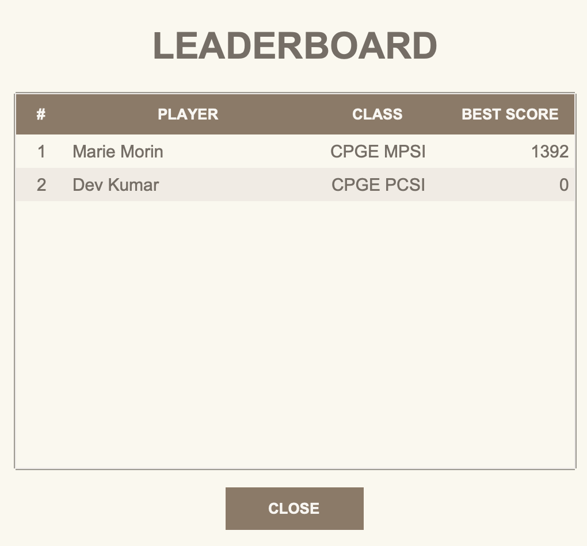

<div align="center">

# The Game 2048

**A complete educational 2048 desktop game built with Python, Tkinter, matrices and SQLite.**

[](https://www.python.org/)
[](https://docs.python.org/3/library/tkinter.html)
[](https://www.sqlite.org/)
[](#testing)
[](LICENSE)

</div>

## Overview

This repository contains a complete object-oriented implementation of the
classic **2048** sliding-tile puzzle. The board is represented by a `4 × 4`
integer matrix, tile combinations are handled by a recursive merge algorithm,
and player profiles, current games and best scores are stored locally in an
SQLite database.

The interface is entirely in English and uses a high-contrast version of the
classic 2048 visual palette. This is an educational reimplementation inspired
by the original open-source 2048 game created by Gabriele Cirulli.

## Features

- Matrix-based `4 × 4` game engine
- Recursive left-to-right merge algorithm
- Correct one-merge-per-tile rule
- Tkinter desktop interface and tile pop animations
- Arrow keys and `W`, `A`, `S`, `D` controls
- Player registration: first name, last name and class
- Automatic best-score saving after every valid move
- Automatic restoration of an interrupted game
- SQLite game history and top-10 leaderboard
- Persistent per-user storage outside the Git repository
- Object-oriented architecture with type hints
- Cross-platform support for macOS, Windows and Linux
- Automated unit tests and GitHub Actions workflow
- No third-party Python dependency

## Video demonstration

<a href="https://youtube.com/shorts/EgfFCmnTLjU?feature=share">
  
</a>

**[Watch the gameplay demonstration on YouTube](https://youtube.com/shorts/EgfFCmnTLjU?feature=share)**

## Screenshots

<table>
  <tr>
    <td align="center"><strong>Player information</strong></td>
    <td align="center"><strong>New game</strong></td>
  </tr>
  <tr>
    <td></td>
    <td></td>
  </tr>
  <tr>
    <td align="center"><strong>Leaderboard</strong></td>
    <td align="center"><strong>Gameplay</strong></td>
  </tr>
  <tr>
    <td></td>
    <td></td>
  </tr>
</table>

## Requirements

### Common requirements

- Python **3.10 or newer**
- Tkinter
- SQLite support

`sqlite3` is included in the Python standard library. Tkinter is also a
standard-library module, but some operating systems distribute its native
Tcl/Tk component as a separate system package.

The project has no third-party Python dependency, so `requirements.txt` is
intentionally empty apart from documentation comments.

## Installation

### macOS with Homebrew

Install a matching Python and Tkinter version:

```bash
brew install python@3.14 python-tk@3.14
```

Make the Homebrew Python the default in new Terminal sessions:

```bash
echo 'export PATH="/usr/local/opt/python@3.14/libexec/bin:/usr/local/opt/python@3.14/bin:$PATH"' >> ~/.zshrc
source ~/.zshrc
hash -r
```

On an Apple Silicon Mac, Homebrew may use `/opt/homebrew` instead of
`/usr/local`. The direct executable also works:

```bash
"$(brew --prefix python@3.14)/bin/python3.14" -m tkinter
```

A small Tk window should open. Close it after the test.

### Ubuntu or Debian

```bash
sudo apt update
sudo apt install python3 python3-tk git
```

### Fedora

```bash
sudo dnf install python3 python3-tkinter git
```

### Windows

1. Install Python 3.10 or newer from the official Python website.
2. During installation, enable **Add Python to PATH**.
3. Keep **Tcl/Tk and IDLE** selected.
4. Install Git for Windows if the repository will be cloned with Git.

Test Tkinter in PowerShell:

```powershell
py -m tkinter
```

## Download and run

### Clone with Git

```bash
git clone https://github.com/devkumar-projects/The-game-2048.git
cd The-game-2048
python3 scripts/check_environment.py
python3 main.py
```

On Windows:

```powershell
git clone https://github.com/devkumar-projects/The-game-2048.git
cd The-game-2048
py scripts/check_environment.py
py main.py
```

### Run an already downloaded ZIP

```bash
cd ~/Downloads
unzip The-game-2048.zip
cd The-game-2048
python3 main.py
```

### Makefile shortcuts

```bash
make check
make run
make test
```

## Controls

| Action | Keys |
|---|---|
| Move left | `←` or `A` |
| Move right | `→` or `D` |
| Move up | `↑` or `W` |
| Move down | `↓` or `S` |
| Start over | **NEW GAME** button |
| View ranking | **LEADERBOARD** button |

Two tiles are generated at the beginning. After every valid move, one new tile
appears in a uniformly selected empty cell. A `2` is generated with probability
`0.9`, and a `4` with probability `0.1`.

## Persistent SQLite data

No player data or score database is committed to this repository. The database
is created automatically on the first launch in the current user's application
data directory:

| Operating system | Database location |
|---|---|
| macOS | `~/Library/Application Support/The Game 2048/scores.db` |
| Windows | `%APPDATA%\The Game 2048\scores.db` |
| Linux | `${XDG_DATA_HOME:-~/.local/share}/The Game 2048/scores.db` |

The database contains three tables:

- `players`: identity, class and best score
- `games`: completed or replaced game sessions
- `saved_games`: one resumable board state per player

The relationship is:

```text
players (1) ──────────< games (N)
    │
    └────────── saved_games (0..1)
```

To erase every local player, score and saved game:

```bash
python3 scripts/reset_data.py
```

For non-interactive deletion:

```bash
python3 scripts/reset_data.py --yes
```

## Project architecture

```text
The-game-2048/
├── .github/
│   ├── ISSUE_TEMPLATE/
│   │   └── bug_report.md
│   └── workflows/
│       └── tests.yml
├── assets/
│   └── screenshots/
│       ├── gameplay.png
│       ├── leaderboard.png
│       ├── new-game.png
│       └── player-information.png
├── game/
│   ├── __init__.py
│   ├── board.py          # Matrix engine and recursive merging
│   ├── constants.py      # Dimensions, colors and animation settings
│   ├── database.py       # SQLite data-access layer
│   ├── storage.py        # Cross-platform persistent data path
│   └── ui.py             # Tkinter windows and animations
├── scripts/
│   ├── check_environment.py
│   └── reset_data.py
├── sql/
│   └── schema.sql
├── tests/
│   ├── test_board.py
│   └── test_database.py
├── .editorconfig
├── .gitignore
├── AUTHORS.md
├── LICENSE
├── Makefile
├── README.md
├── main.py
└── requirements.txt
```

### Main classes

| Class | Responsibility |
|---|---|
| `Board` | Stores the matrix, moves tiles, merges equal values and detects win/loss states |
| `MoveResult` | Immutable result of a move: movement, score gain, merged cells and new tile |
| `ScoreDatabase` | Creates profiles, saves scores, restores games and queries the leaderboard |
| `Game2048App` | Coordinates the engine, persistence, input events and Tkinter rendering |
| `PlayerDialog` | Collects the player's first name, last name and class |
| `LeaderboardDialog` | Displays the ten highest persistent scores |

## Mathematical model

### 1. Board as a matrix

At time `t`, the board is represented by a matrix

$$
B_t = \left[b_{ij}^{(t)}\right] \in
\left(\{0\} \cup \{2^k \mid k \in \mathbb{N},\ k \ge 1\}\right)^{4 \times 4}.
$$

A zero represents an empty cell. Every non-zero tile is a power of two:

$$
v_k = 2^k, \qquad k \ge 1.
$$

### 2. Compression operator

For a row vector `r`, the compression operator `C` removes every zero while
preserving the order of the non-zero elements. Zeros are appended afterwards
to restore the row length.

For example:

$$
C([2,0,2,4]) = [2,2,4,0].
$$

### 3. Recursive merge rule

Equal adjacent powers of two are combined according to

$$
2^k + 2^k = 2^{k+1}.
$$

For a compressed list, the recursive merge function is defined conceptually by

$$
M([]) = ([],0),
$$

$$
M([x]) = ([x],0),
$$

and, when the first two values are equal,

$$
M([x,x] \mathbin{\|} r)
= ([2x] \mathbin{\|} y,\ 2x+s),
\quad \text{where } (y,s)=M(r).
$$

When the first two values differ,

$$
M([x,z] \mathbin{\|} r)
= ([x] \mathbin{\|} y,\ s),
\quad x \ne z,
\quad \text{where } (y,s)=M([z] \mathbin{\|} r).
$$

The symbol `\|` denotes list concatenation. Removing both equal values before
the recursive call guarantees that a newly created tile cannot merge again in
the same move.

Example:

$$
M([2,2,2,2]) = ([4,4],8),
$$

not `[8]`. The score gain is `4 + 4 = 8`.

### 4. Direction transformations

The same left-merge operation is reused for every direction:

- left: merge each row directly;
- right: reverse each row, merge left, then reverse again;
- up: read each column from top to bottom and merge it as a row;
- down: read each column from bottom to top, merge, then restore the order.

If `R` is row reversal and `T` is matrix transposition, the transformations can
be summarized as

$$
L(B)=\text{merge-left}(B),
$$

$$
R_{move}(B)=R\bigl(L(R(B))\bigr),
$$

$$
U(B)=T\bigl(L(T(B))\bigr),
$$

$$
D(B)=T\Bigl(R\bigl(L(R(T(B)))\bigr)\Bigr).
$$

### 5. Score update

When a move creates merged tiles with values
`m_1, m_2, ..., m_q`, the score evolves as

$$
S_{t+1}=S_t+\sum_{p=1}^{q}m_p.
$$

For example, merging `[2,2,4,4]` produces `[4,8]` and adds

$$
\Delta S = 4+8=12.
$$

### 6. Random tile generation

Let `E_t` be the set of empty cells after a valid move. The new position is
uniformly distributed:

$$
\Pr(P=(i,j))=\frac{1}{|E_t|}, \qquad (i,j)\in E_t.
$$

The new tile value `X` follows

$$
\Pr(X=2)=0.9,
\qquad
\Pr(X=4)=0.1.
$$

Its expected value is therefore

$$
\mathbb{E}[X]=2(0.9)+4(0.1)=2.2.
$$

### 7. Win and game-over conditions

The target is reached when

$$
\max_{i,j} b_{ij}^{(t)} \ge 2048.
$$

The game is over when there is no empty cell and no horizontally or vertically
adjacent pair has the same value. Equivalently, every legal direction leaves
the matrix unchanged.

### 8. Complexity

For an `n × n` board, every move visits every cell a constant number of times:

$$
T(n)=\Theta(n^2),
\qquad
M(n)=\Theta(n^2).
$$

For the standard game, `n=4`, so each move has a very small fixed cost.

## Recursive merge pseudocode

```text
MERGE(values):
    if values is empty:
        return empty list, score 0

    if values has at least two elements
       and values[0] equals values[1]:
        merged_value = 2 × values[0]
        merged_tail, tail_score = MERGE(values after the first two)
        return [merged_value] + merged_tail,
               merged_value + tail_score

    merged_tail, tail_score = MERGE(values after the first)
    return [values[0]] + merged_tail, tail_score
```

## Testing

Run the complete unit-test suite:

```bash
python3 -m unittest discover -s tests -v
```

The tests cover:

- simple recursive merges;
- prevention of double merging;
- chain merges;
- horizontal and vertical movement;
- unchanged moves;
- game-over detection;
- player creation and reuse;
- best-score monotonicity;
- leaderboard updates;
- saved-game serialization and restoration;
- saved-game deletion.

The GitHub Actions workflow repeats the tests on Python 3.10 through 3.14.

## Troubleshooting

### `ModuleNotFoundError: No module named '_tkinter'`

The active Python interpreter was installed without a matching Tkinter package.
On macOS with Homebrew:

```bash
brew install python@3.14 python-tk@3.14
"$(brew --prefix python@3.14)/bin/python3.14" -m tkinter
"$(brew --prefix python@3.14)/bin/python3.14" main.py
```

### The command `python3` uses an older Python

Check the executable and version:

```bash
which python3
python3 --version
```

Then launch with the explicit Homebrew interpreter:

```bash
"$(brew --prefix python@3.14)/bin/python3.14" main.py
```

### Reset the leaderboard and saved game

```bash
python3 scripts/reset_data.py --yes
```

## Contributing

Bug reports and improvements are welcome. Before opening a pull request:

1. keep the interface text in English;
2. preserve the matrix engine and one-merge-per-move rule;
3. do not commit local SQLite databases;
4. add or update tests for behavioral changes;
5. run the complete test suite.

## Authors

- **Dev Kumar**
- **Michel Attoum**
- **Celine Fernandes**

## License

Distributed under the [MIT License](LICENSE).

## Historical note

**This project was originally realized in 2018 in a High School / CPGE PCSI
context. Level: Beginner.**
